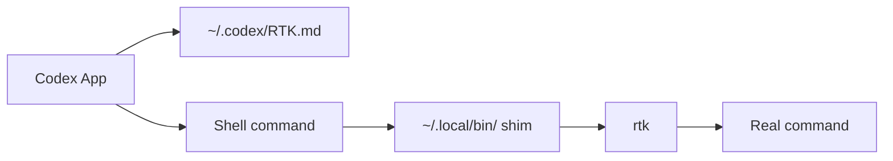

# Codex App + RTK Bootstrap

Make new Codex App sessions on macOS prefer RTK for supported shell commands.

This is a user-level bootstrap, not a project-level integration. It changes your Codex config and local command shims, but it does not touch your repo code.

## TL;DR

```bash
brew install rtk
git clone https://github.com/Akimiya-z/codex-rtk-bootstrap.git
cd codex-rtk-bootstrap
./install.sh
```

Restart the Codex app, then open a new chat and ask it to run `git status`. You should see `rtk git status`.

## What it installs

- `~/.codex/RTK.md`
- `~/.codex/AGENTS.md` with an `@RTK.md` reference
- `~/.codex/config.toml` with `model_instructions_file`
- `~/.local/bin/rtk-shim`
- command shims in `~/.local/bin` for the high-value RTK-supported commands, including `git`, `gh`, `ls`, `find`, `tree`, `grep`, `curl`, `docker`, `kubectl`, `pytest`, `ruff`, `go`, `tsc`, `prettier`, `pnpm`, `npm`, `npx`, `pip`, `diff`, `wc`, `env`, and `psql`

## How it works

1. Codex reads `~/.codex/RTK.md` as a model instruction file.
2. Your shell resolves common command names from `~/.local/bin` first.
3. The shim forwards supported commands through `rtk`.
4. `rtk` compresses the output before Codex sees it.



## Requirements

- macOS
- Codex desktop app
- `rtk` installed locally
- `~/.local/bin` before the system command paths in `PATH`

If you need to add it:

```bash
echo 'export PATH="$HOME/.local/bin:$PATH"' >> ~/.zshrc
```

## Install

```bash
./install.sh
```

Environment knobs:

- `RTK_BIN` sets a custom RTK binary path.
- `RTK_SHIM_COMMANDS` overrides the default shimmed command list.

## Verify

Run these locally:

```bash
which git
git status
```

In a new Codex App chat, ask:

```text
Please run git status and tell me the exact command you used.
```

If the setup is working, Codex should report `rtk git status`.

## Uninstall

```bash
./uninstall.sh
```

## Notes

- This setup is user-local, not repo-local.
- New Codex app sessions will pick up the RTK instructions and the PATH shims.
- The repo does not change your existing project files.
- If you already have a different `model_instructions_file` in `~/.codex/config.toml`, merge it manually before running the installer.
- RTK only helps for supported shell commands; it does not rewrite every tool call.
- The bootstrap only shims the high-value supported commands by default. Add more via `RTK_SHIM_COMMANDS` if you know you want them.

## For

- People using the Codex desktop app on macOS who want RTK without hand-configuring every machine.
- People who want a repeatable install script they can run on a fresh Mac.
